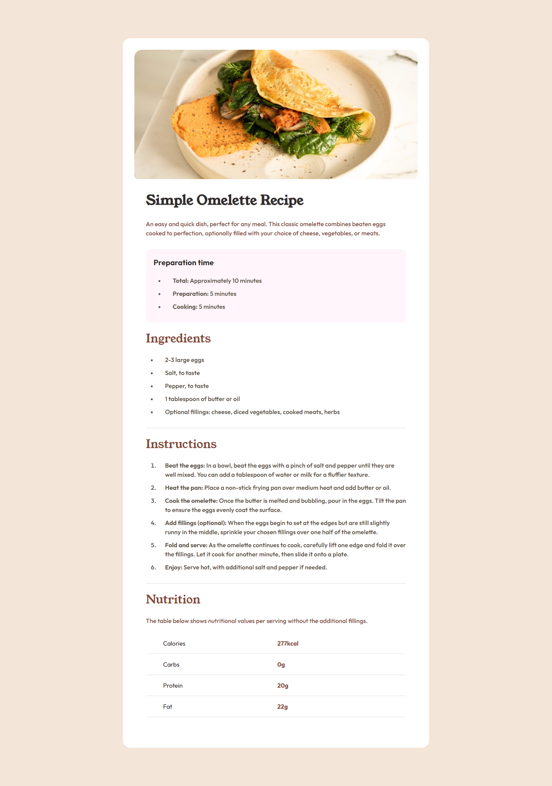

# Frontend Mentor - Recipe page solution

This is a solution to the [Recipe page challenge on Frontend Mentor](https://www.frontendmentor.io/challenges/recipe-page-KiTsR8QQKm). Frontend Mentor challenges help you improve your coding skills by building realistic projects. 

## Table of contents

- [Overview](#overview)
  - [The challenge](#the-challenge)
  - [Screenshot](#screenshot)
  - [Links](#links)
- [My process](#my-process)
  - [Built with](#built-with)
  - [What I learned](#what-i-learned)
  - [Continued development](#continued-development)
- [Author](#author)

## Overview

### Screenshot

### Links

- Solution URL: [solution URL](https://github.com/YahiaG/Recipe-page)
- Live Site URL: [live site URL](https://yahiag.github.io/Recipe-page/)

## My process

### Built with

- Semantic HTML5 markup
- CSS custom properties
- Flexbox
- CSS Grid
- Mobile-first workflow

### What I learned

I learnt that HTML structure is very important and can help make styling easier.
dividing design to sections helped me target every section without too many selectors.

### Continued development

I need to practice more HTML & CSS to strengthen my weak points.

## Author

- Frontend Mentor - [@Yahia Ali](https://www.frontendmentor.io/profile/YahiaG)
- LinkedIn - [Yahia Ali](https://www.linkedin.com/in/Yahia-Ali22)

